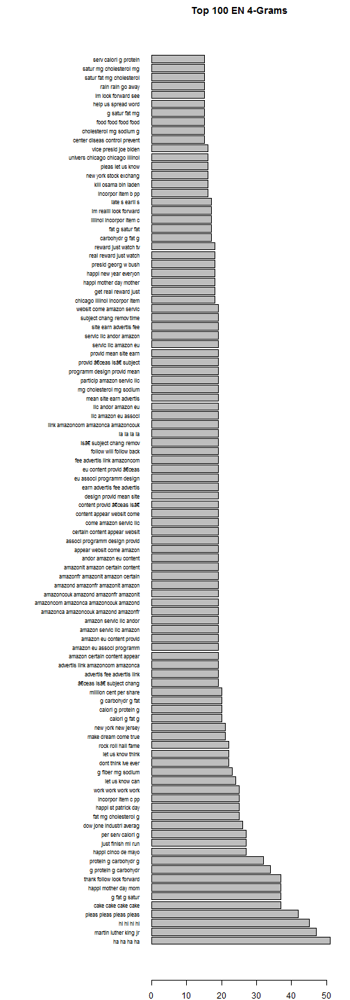

# Data Science Captsone Milestone Report
**Shabbir Suterwala**

## Executive Summary
The purpose of this report is to establish an understanding of basic tasks required for data processing of a text corpus. English Blogs, News and Twitter corpora are analyised for word, line and unique word counts. Furthermore top 1gram, 2grams and 3grams are presented. 

## Code
The entire source code used to generate this report can be downloaded from https://github.com/shabss/ds-capstone.

## Data Analysis Level 1
The data was obtained from the link https://d396qusza40orc.cloudfront.net/dsscapstone/dataset/Coursera-SwiftKey.zip, which is provided with the course. The zip contains copora of blogs, news and twitter in 4 languages English, Dutch, French and Russian. The statistics of the combined corpous is as follows: 


```r
source("milestone.R")
if (!exists("ds.stat")) {
    dss <- get_dataset_stats("Coursera-SwiftKey/final")
    dss$file <- gsub("Coursera-Swiftkey/final/.*/(..)_..(.*).txt", "\\1\\2",
                     as.character(dss$file), perl=TRUE, ignore.case=TRUE)
    dss[, c(2,3,4,6)] <- round(dss[, c(2,3,4,6)] / 1000000, digits = 4)
    names(dss) <- c("File", "Lines (mil)", "Words (mil)",
                    "Unique (mil)", "% Unique", "Bytes (MB)") 
    ds.stat <<- dss
} 
```
<!-- html table generated in R 3.1.3 by xtable 1.7-4 package -->
<!-- Sun Jul 26 12:38:24 2015 -->
<table border='5px solid black' align='center'>
<tr> <th> File </th> <th> Lines (mil) </th> <th> Words (mil) </th> <th> Unique (mil) </th> <th> % Unique </th> <th> Bytes (MB) </th>  </tr>
  <tr> <td> de.blogs </td> <td align="right"> 0.37 </td> <td align="right"> 12.61 </td> <td align="right"> 0.39 </td> <td align="right"> 3.06 </td> <td align="right"> 85.46 </td> </tr>
  <tr> <td> de.news </td> <td align="right"> 0.24 </td> <td align="right"> 13.20 </td> <td align="right"> 0.38 </td> <td align="right"> 2.88 </td> <td align="right"> 95.59 </td> </tr>
  <tr> <td> de.twitter </td> <td align="right"> 0.95 </td> <td align="right"> 11.79 </td> <td align="right"> 0.32 </td> <td align="right"> 2.75 </td> <td align="right"> 75.58 </td> </tr>
  <tr> <td> en.blogs </td> <td align="right"> 0.90 </td> <td align="right"> 37.27 </td> <td align="right"> 0.25 </td> <td align="right"> 0.68 </td> <td align="right"> 210.16 </td> </tr>
  <tr> <td> en.news </td> <td align="right"> 1.01 </td> <td align="right"> 34.31 </td> <td align="right"> 0.21 </td> <td align="right"> 0.62 </td> <td align="right"> 205.81 </td> </tr>
  <tr> <td> en.twitter </td> <td align="right"> 2.36 </td> <td align="right"> 30.34 </td> <td align="right"> 0.30 </td> <td align="right"> 1.00 </td> <td align="right"> 167.11 </td> </tr>
  <tr> <td> fi.blogs </td> <td align="right"> 0.44 </td> <td align="right"> 12.71 </td> <td align="right"> 0.87 </td> <td align="right"> 6.81 </td> <td align="right"> 108.50 </td> </tr>
  <tr> <td> fi.news </td> <td align="right"> 0.49 </td> <td align="right"> 10.41 </td> <td align="right"> 0.68 </td> <td align="right"> 6.54 </td> <td align="right"> 94.23 </td> </tr>
  <tr> <td> fi.twitter </td> <td align="right"> 0.29 </td> <td align="right"> 3.15 </td> <td align="right"> 0.30 </td> <td align="right"> 9.49 </td> <td align="right"> 25.33 </td> </tr>
  <tr> <td> ru.blogs </td> <td align="right"> 0.34 </td> <td align="right"> 2.04 </td> <td align="right"> 0.02 </td> <td align="right"> 0.99 </td> <td align="right"> 116.86 </td> </tr>
  <tr> <td> ru.news </td> <td align="right"> 0.20 </td> <td align="right"> 1.80 </td> <td align="right"> 0.01 </td> <td align="right"> 0.54 </td> <td align="right"> 119.00 </td> </tr>
  <tr> <td> ru.twitter </td> <td align="right"> 0.88 </td> <td align="right"> 2.42 </td> <td align="right"> 0.02 </td> <td align="right"> 0.91 </td> <td align="right"> 105.18 </td> </tr>
   </table>

## Data Preparation

We will primarily work with English dataset. Working with full English dataset took long time for the desktop computer. So we decided to break the data into a smaller set for this report: 


```r
breakdown <- list(train=60, cv=20, test=20)
report.breakdown <- list(train=10, cv=45, test=45)
xt <- xtable(data.frame(Type=c("Training %", "CV %", "Test %"),
                        Project=unlist(breakdown), 
                        Report=unlist(report.breakdown)))
```
<!-- html table generated in R 3.1.3 by xtable 1.7-4 package -->
<!-- Sun Jul 26 12:38:24 2015 -->
<table border='5px solid black' align='center'>
<tr> <th> Type </th> <th> Project </th> <th> Report </th>  </tr>
  <tr> <td> Training % </td> <td align="right"> 60.00 </td> <td align="right"> 10.00 </td> </tr>
  <tr> <td> CV % </td> <td align="right"> 20.00 </td> <td align="right"> 45.00 </td> </tr>
  <tr> <td> Test % </td> <td align="right"> 20.00 </td> <td align="right"> 45.00 </td> </tr>
   </table>

Thus the English training data for this report looks as follows:

```r
train.dir <- sprintf("data.%02d", report.breakdown$train)
ds <- get_dataset(train.dir, report.breakdown)

if (!exists("ds.prep.stat")) {
    dps <- get_dataset_stats(train.dir)
    dps$file <- gsub(paste0(train.dir,"/.*/(..)_..(.*).txt.(.*)"), "\\1\\2 \\3",
                     as.character(dps$file),
                     perl=TRUE, ignore.case=TRUE)
    dps[, c(2,3,4,6)] <- round(dps[, c(2,3,4,6)] / 1000000, digits = 4)
    names(dps) <- c("File", "Lines (mil)", "Words (mil)",
                    "Unique (mil)", "% Unique", "Bytes (MB)")    
    ds.prep.stat <<- dps[grep("^en", dps$File),]
}
```
<!-- html table generated in R 3.1.3 by xtable 1.7-4 package -->
<!-- Sun Jul 26 12:38:24 2015 -->
<table border='5px solid black' align='center'>
<tr> <th> File </th> <th> Lines (mil) </th> <th> Words (mil) </th> <th> Unique (mil) </th> <th> % Unique </th> <th> Bytes (MB) </th>  </tr>
  <tr> <td> en.blogs cv </td> <td align="right"> 0.40 </td> <td align="right"> 16.75 </td> <td align="right"> 0.17 </td> <td align="right"> 1.03 </td> <td align="right"> 94.07 </td> </tr>
  <tr> <td> en.blogs test </td> <td align="right"> 0.40 </td> <td align="right"> 16.76 </td> <td align="right"> 0.17 </td> <td align="right"> 1.03 </td> <td align="right"> 94.07 </td> </tr>
  <tr> <td> en.blogs train </td> <td align="right"> 0.09 </td> <td align="right"> 3.76 </td> <td align="right"> 0.08 </td> <td align="right"> 2.24 </td> <td align="right"> 21.12 </td> </tr>
  <tr> <td> en.news cv </td> <td align="right"> 0.45 </td> <td align="right"> 15.43 </td> <td align="right"> 0.15 </td> <td align="right"> 0.99 </td> <td align="right"> 92.13 </td> </tr>
  <tr> <td> en.news test </td> <td align="right"> 0.46 </td> <td align="right"> 15.45 </td> <td align="right"> 0.15 </td> <td align="right"> 0.99 </td> <td align="right"> 92.21 </td> </tr>
  <tr> <td> en.news train </td> <td align="right"> 0.10 </td> <td align="right"> 3.43 </td> <td align="right"> 0.08 </td> <td align="right"> 2.36 </td> <td align="right"> 20.46 </td> </tr>
  <tr> <td> en.twitter cv </td> <td align="right"> 1.06 </td> <td align="right"> 13.66 </td> <td align="right"> 0.19 </td> <td align="right"> 1.42 </td> <td align="right"> 74.17 </td> </tr>
  <tr> <td> en.twitter test </td> <td align="right"> 1.06 </td> <td align="right"> 13.64 </td> <td align="right"> 0.19 </td> <td align="right"> 1.42 </td> <td align="right"> 74.07 </td> </tr>
  <tr> <td> en.twitter train </td> <td align="right"> 0.24 </td> <td align="right"> 3.04 </td> <td align="right"> 0.08 </td> <td align="right"> 2.77 </td> <td align="right"> 16.51 </td> </tr>
   </table>

## Data Analysis

The 1-gram, 2-gram, 3-gram, 4-gram and 5-gram for Blogs, Twitter and News are as follows:

```r
make_ngrams(train.dir)
```

```r
freq.en.1grams <<- freq_ngrams(en.1grams, 100, "EN 1-Grams");
```

 

```r
freq.en.2grams <<- freq_ngrams(en.2grams, 100, "EN 2-Grams");
```

 

```r
freq.en.3grams <<- freq_ngrams(en.3grams, 100, "EN 3-Grams");
```

 

```r
freq.en.4grams <<- freq_ngrams(en.4grams, 100, "EN 4-Grams");
```

 

```r
freq.en.5grams <<- freq_ngrams(en.5grams, 100, "EN 5-Grams");
```

 


## Modeling Strategy

To build the prediction model following tasks has to be further performed

   1. Use porter stemming to improve N-gram frequencies. This will help reduce data footprint of the model. Build up N-gram models and evaluate performance of each until a reasonable accuracy is met. 
   2. Use PCFG to understand the sentence structure. This will help with predicting the right POS. Since our model will be based on stemmed documents, this will help with not only predicting the right word it will also help selecting the right stop words and, in particular, the conjunctions.  
   3. Once probable words are found with combining porter stemming and PCFG, Use backoff strategy to predict probability of a given word. Have two strategies to predict 1) the words and 2) stop words and conjunctions. 
   4. Only use frequently used words - the exact balance will be determined during training and CV. This will assist with reducing the overfit and reduce the data footprint required for execution.
   5. Create a dictionary of words. Use indexes into this dictionary to build N-gram models. This will help with both compression and  fast lookups.
   
## Logistic Strategy

### Training 
Given the resource requirements for the tm package we will break the training data into multiple pieces and distribute this on multiple machines. Too keep things simple file system will be used as data sharing mechanism. 

   1. Training dataset will equally split into 10 parts. This can easily be done with Linux/Unix utilities.
   2. A total of 4 computers will be used to perform the tasks. Each computer will read the training set from folder that is shared and write the data to the shared folder. Tasks are:
      1. Creating Document Term Matrix for training part N
      2. Creating a merged model from individual models
   3. One master computer will issue the tasks. The master will will also execute tasks.

To reduce the data foot print other NLP smooting methods besides backoff smooting will be analzed and best will be picked.

### Application Execution
Since ShinyApps server can only accept limited amount of data, following strategy will be employed:

   1. Upload a compressed dictionary of words and indexed N-grams. 
   2. If the data is still larger than what ShinyApps server allows then build a restful interface on Amazon to serve the initialization data.

# Conclusion
English Blogs, News and Twitter corpora are analyised for word, line and unique word counts and corresponding 1gram, 2grams and 3grams are presented. Additionally, strategies for building a machine learning model to predict the next word is provided.

# References
1. http://nlp.stanford.edu/~wcmac/papers/20050421-smoothing-tutorial.pdf
